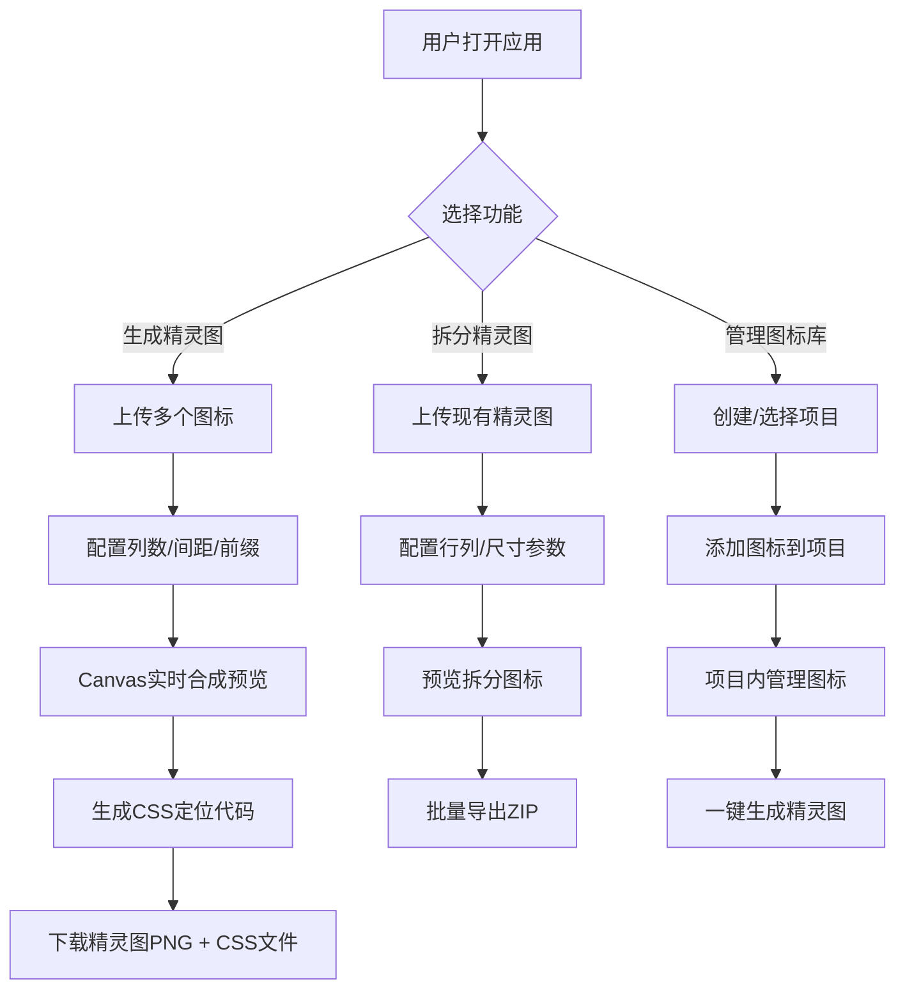

## 1. 产品概述

CSS精灵图生成与管理工具，帮助前端开发者快速将多个小图标合成为一张精灵图（Sprite Sheet），并自动生成对应的CSS定位代码。同时支持反向拆分现有精灵图，以及按项目分组管理图标库。

- 目标用户：前端开发者、UI设计师
- 核心价值：减少HTTP请求、提升页面性能、简化图标管理工作流

## 2. 核心功能

### 2.1 用户角色

| 角色 | 注册方式 | 核心权限 |
|------|----------|----------|
| 普通用户 | 无需注册，本地使用 | 使用全部功能，数据存储在本地浏览器 |

### 2.2 功能模块

1. **精灵图生成器**：图标上传、参数配置、Canvas合成、CSS代码输出
2. **精灵图拆分器**：导入现有精灵图、网格检测/手动配置、拆分导出单个图标
3. **图标库管理器**：项目分组、图标增删改、历史版本、追加重新生成

### 2.3 页面详情

| 页面名称 | 模块名称 | 功能描述 |
|----------|----------|----------|
| 精灵图生成器 | 上传区域 | 拖拽/点击上传多个图标文件，支持PNG/JPG/SVG |
| 精灵图生成器 | 参数配置 | 设置排列列数、图标间距、背景色、类名前缀 |
| 精灵图生成器 | 预览区域 | 实时预览合成后的精灵图，可缩放查看 |
| 精灵图生成器 | 代码输出 | 生成CSS类名和background-position代码，支持复制和下载 |
| 精灵图拆分器 | 导入区域 | 上传现有精灵图，支持拖拽 |
| 精灵图拆分器 | 拆分配置 | 设置行列数、图标尺寸、间距，或自动检测 |
| 精灵图拆分器 | 预览导出 | 预览拆分后的单个图标，批量下载为ZIP |
| 图标库管理器 | 项目列表 | 创建/删除/重命名项目分组 |
| 图标库管理器 | 图标管理 | 在项目中添加/删除/预览图标 |
| 图标库管理器 | 快速生成 | 从项目图标一键生成精灵图 |

## 3. 核心流程

用户上传图标 → 配置排列参数 → 实时预览合成效果 → 生成CSS代码 → 下载精灵图和CSS文件

## 4. 用户界面设计

### 4.1 设计风格
- **主色调**：深靛蓝 (#1e1b4b) 配霓虹青 (#22d3ee)，深色工业风
- **辅助色**：琥珀橙 (#f59e0b) 用于强调操作，玫瑰红 (#f43f5e) 用于危险操作
- **背景**：深色渐变 + 细微网格纹理，营造开发者工具氛围
- **按钮风格**：扁平化设计，轻微圆角 (6px)，hover时发光效果
- **字体**：JetBrains Mono (代码显示) + Space Grotesk (界面文字)
- **布局**：左侧导航 + 右侧内容区，三栏式工作台布局
- **图标风格**：简洁线性图标，统一2px描边

### 4.2 页面设计概述

| 页面名称 | 模块名称 | UI元素 |
|----------|----------|--------|
| 精灵图生成器 | 上传区 | 虚线边框拖放区，hover时发光，显示已上传图标缩略图网格 |
| 精灵图生成器 | 参数面板 | 滑块控件、数字输入、颜色选择器、即时响应预览 |
| 精灵图生成器 | 预览区 | 带标尺的画布，支持鼠标滚轮缩放，hover显示图标信息 |
| 精灵图生成器 | 代码区 | 语法高亮显示，一键复制按钮，标签页切换CSS/SCSS |
| 图标库管理器 | 项目列表 | 卡片式项目展示，显示项目名称、图标数量、最后修改时间 |
| 图标库管理器 | 图标网格 | 响应式网格布局，hover显示操作按钮，支持多选批量操作 |

### 4.3 响应式

桌面端优先设计（≥1280px），适配平板（≥768px）时折叠导航为抽屉式，移动端（<768px）简化为单列布局，所有触摸目标≥44px。

