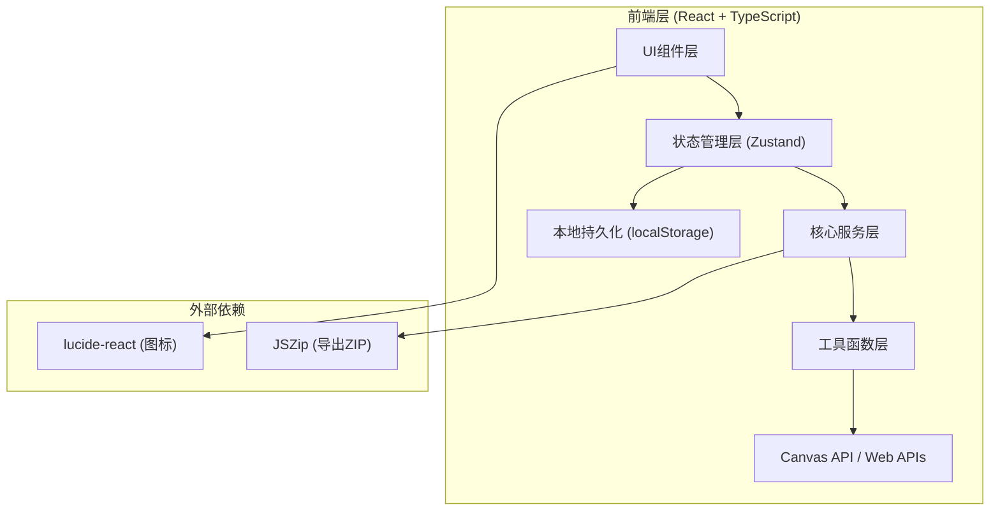
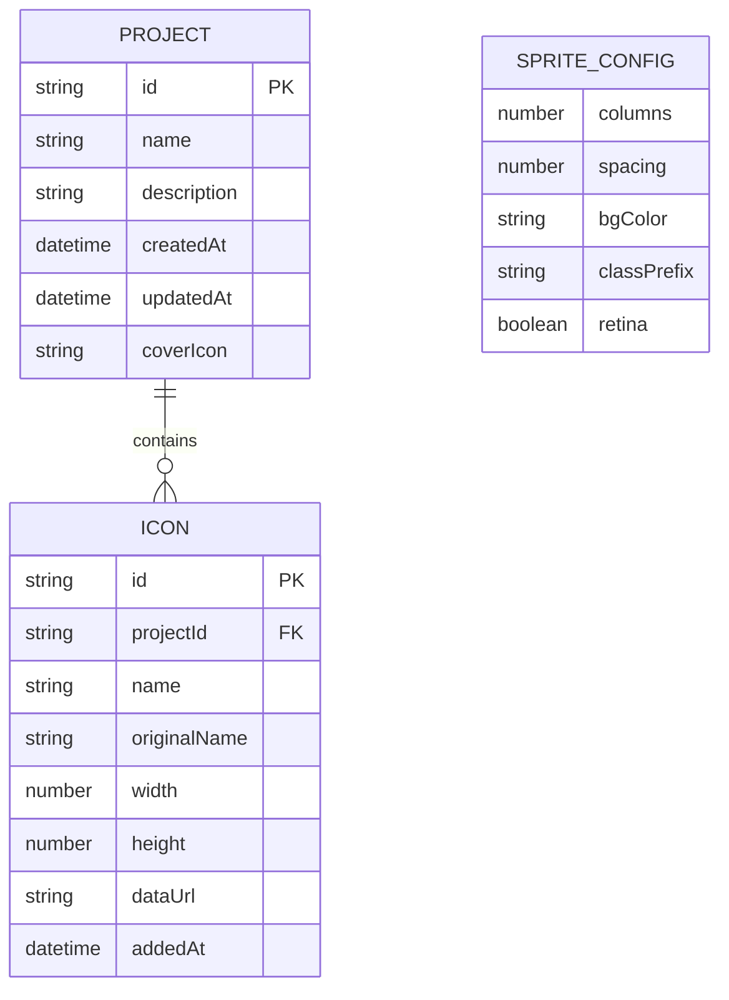

## 1. 架构设计



## 2. 技术描述

- **前端框架**: React 18 + TypeScript
- **构建工具**: Vite 5
- **样式方案**: TailwindCSS 3 + CSS Variables
- **状态管理**: Zustand (轻量级状态管理)
- **图标库**: lucide-react
- **文件处理**: JSZip (批量导出ZIP)
- **后端**: 无，纯前端应用，所有数据本地存储
- **存储**: localStorage (存储项目和图标元数据) + IndexedDB (存储较大的图片blob)

## 3. 路由定义

| 路由 | 用途 |
|------|------|
| /generator | 精灵图生成器（默认首页） |
| /splitter | 精灵图拆分器 |
| /library | 图标库管理器 |

## 4. 数据模型

### 4.1 数据模型定义



### 4.2 核心TypeScript类型

```typescript
interface IconItem {
  id: string;
  name: string;
  originalName: string;
  width: number;
  height: number;
  dataUrl: string;
  addedAt: number;
}

interface Project {
  id: string;
  name: string;
  description: string;
  iconIds: string[];
  createdAt: number;
  updatedAt: number;
}

interface SpriteConfig {
  columns: number;
  spacing: number;
  bgColor: string;
  classPrefix: string;
  retina: boolean;
}

interface SpriteResult {
  imageDataUrl: string;
  cssCode: string;
  scssCode: string;
  iconPositions: IconPosition[];
  totalWidth: number;
  totalHeight: number;
}

interface IconPosition {
  id: string;
  name: string;
  x: number;
  y: number;
  width: number;
  height: number;
}
```

## 5. 模块结构

```
src/
├── components/
│   ├── layout/          # 布局组件 (Sidebar, Header)
│   ├── generator/       # 生成器相关组件
│   ├── splitter/        # 拆分器相关组件
│   └── library/         # 图标库相关组件
├── hooks/               # 自定义Hooks
├── store/               # Zustand状态管理
├── services/            # 核心业务逻辑
│   ├── spriteGenerator.ts   # 精灵图合成
│   ├── spriteSplitter.ts    # 精灵图拆分
│   └── codeGenerator.ts     # CSS代码生成
├── types/               # TypeScript类型定义
├── utils/               # 工具函数
├── App.tsx
├── main.tsx
└── index.css
```

## 6. 核心算法说明

### 6.1 精灵图合成算法
1. 获取所有图标的最大宽高，确定单元格子尺寸
2. 根据列数计算行数 = ceil(图标总数 / 列数)
3. 画布总宽 = 列数 × (单元宽 + 间距) + 间距
4. 画布总高 = 行数 × (单元高 + 间距) + 间距
5. 遍历图标，计算每个图标的x/y坐标（居中对齐于格子）
6. 按坐标绘制到Canvas上

### 6.2 CSS代码生成
- 生成基础 `.sprite` 类（设置背景图、尺寸）
- 为每个图标生成 `.sprite-{name}` 类（设置 background-position）
- 支持 SCSS 变量和 mixin 模式输出

### 6.3 精灵图拆分算法
1. 将图片绘制到Canvas
2. 根据配置的行列数/图标尺寸计算每个子图的区域
3. 逐个区域裁剪并导出为独立PNG
4. 支持自动检测：扫描透明像素边界确定图标尺寸

